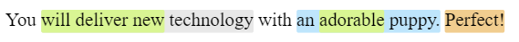

# Highlighting Text Code Challenge

## Set-up
* Used: `create-react-app`
* Used: `eslint`, `Google` style guide for linting
* Used: `react-html-parser` for parsing `html` string into `jsx`
* Used: `Koala` to compile `SCSS` into `CSS`

## Thought process
* First, I analyzed the task's output:
  * The clue that I got was the round corners of highlights -> which need to be mapped to `<span><span></span></span>` structure (where lower priority highlight need to be expanded in order to preserve round corners) instead of `<span></span><span></span>` structure. That discovery illuminated a couple of thoughts.
* So the algorithm that I've chosen might be divided on 2 parts:
  * map through sorted-by `startOffset` `highlights` array so all intersections would be properly handled.
  * loop through sorted-by `endOffset` `highlights` array and alter the string, inserting into it closing and opening `span` tags with `background: color`.
* Created a simple `App` component that renders the output of my `highlight` function.

## Solution


Live demo https://highlightcodechallenge.netlify.com/

## Tested with the following string / cases
```js
// Input ======================================================================
const str = `You will deliver new technology with an adorable puppy. Perfect! Lorem ipsum dolor, sit amet consectetur adipisicing elit. Exercitationem ex, sunt quae, dicta accusantium quam natus cupiditate perferendis molestias voluptates, dolorem quod? Veritatis temporibus voluptate eos nemo consequatur sunt ipsum.
Iure quos iste quas voluptatum tempora distinctio dolores adipisci minima, voluptates accusamus aspernatur id, recusandae, natus rerum ea ratione perferendis quaerat labore dolorum itaque fuga consectetur. Dolorem natus neque nobis?
Eum repudiandae aliquid libero quos culpa eaque fugiat, saepe laborum enim dolores voluptas suscipit aperiam. Magnam, natus illum in explicabo incidunt numquam, ex provident dicta ipsum, aperiam quod consectetur. Nobis!
Impedit necessitatibus nisi ab facilis odit quod delectus ea quo, sunt laudantium excepturi, reprehenderit amet consectetur tempore sed inventore deserunt dolores cum fugit dolore possimus eos tenetur mollitia. Dolorum, iure!
Ratione, laboriosam. Fuga quos dignissimos earum minima perferendis! Quas possimus ratione sunt, soluta harum perferendis provident accusamus consectetur velit, doloribus quaerat sapiente sed nisi quis laborum incidunt nihil nobis vel!`;

const highlightsInput = [
  {startOffset: 4, endOffset: 20, color: '#d9f593', priority: 0},
  {startOffset: 17, endOffset: 31, color: '#e8e8e8', priority: 1},
  {startOffset: 40, endOffset: 48, color: '#d9f593', priority: 2},
  {startOffset: 37, endOffset: 55, color: '#BEE5FC', priority: 3},
  {startOffset: 56, endOffset: 64, color: '#F1CD8F', priority: 4},
  {startOffset: 100, endOffset: 150, color: '#d9f593', priority: 0},
  {startOffset: 110, endOffset: 120, color: '#BEE5FC', priority: 1},
  {startOffset: 200, endOffset: 250, color: '#d9f593', priority: 1},
  {startOffset: 210, endOffset: 220, color: '#BEE5FC', priority: 0},
  {startOffset: 260, endOffset: 280, color: '#d9f593', priority: 0},
  {startOffset: 270, endOffset: 300, color: '#BEE5FC', priority: 1},
  {startOffset: 310, endOffset: 330, color: '#d9f593', priority: 1},
  {startOffset: 320, endOffset: 350, color: '#BEE5FC', priority: 0},
  {startOffset: 360, endOffset: 380, color: '#d9f593', priority: 0},
  {startOffset: 375, endOffset: 380, color: '#F1CD8F', priority: 2},
  {startOffset: 370, endOffset: 400, color: '#BEE5FC', priority: 1},
  {startOffset: 500, endOffset: 600, color: '#d9f593', priority: 0},
  {startOffset: 570, endOffset: 600, color: '#F1CD8F', priority: 2},
  {startOffset: 550, endOffset: 600, color: '#BEE5FC', priority: 1},
  {startOffset: 600, endOffset: 700, color: '#d9f593', priority: 2},
  {startOffset: 670, endOffset: 700, color: '#F1CD8F', priority: 0},
  {startOffset: 650, endOffset: 700, color: '#BEE5FC', priority: 1},
  {startOffset: 100, endOffset: 200, color: '#d9f593', priority: 2},
  {startOffset: 300, endOffset: 400, color: '#F1CD8F', priority: 0},
  {startOffset: 600, endOffset: 700, color: '#BEE5FC', priority: 1},
];
// ============================================================================
```
### Notes
* I've started to write `highlight.test.js` file to create automatic tests, however, the output of the function is complex and requires time, so tests were manual.
* Tested in `Google Chrome`, `Opera`, `Edge`, `Mozilla` (doesn't work for some reason)

## Assumptions
1. `color` is always HEXx6
2. `endOffset` is always bigger than `startOffset`

## Further Development
* Figure out why my code doesn't work in `Mozilla` and fix the problem
